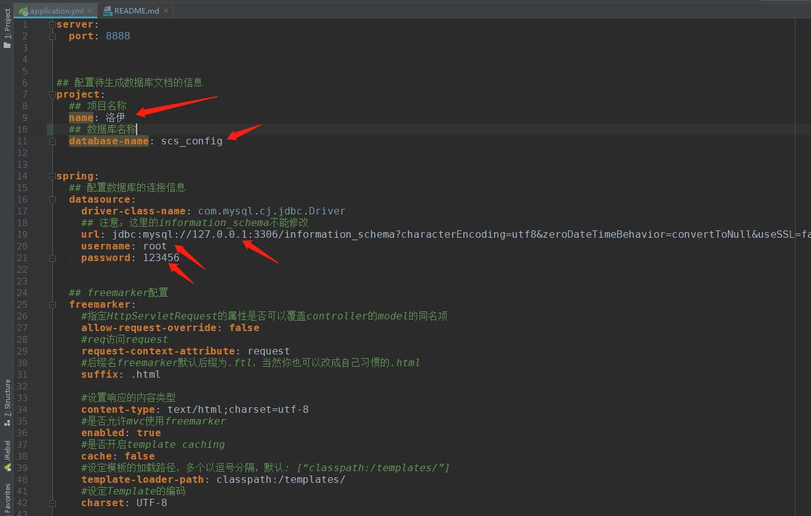
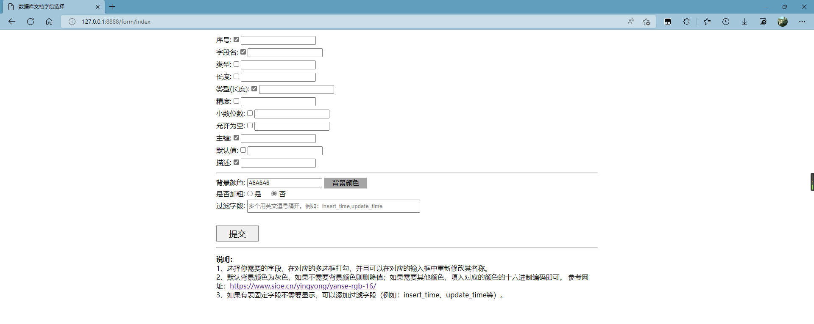

# 前言
在日常的开发工作中，偶尔会遇到项目收尾需要提供数据库设计文档的情况。  
对这个文档的编写目前应该已经基本没有问题了，如果你还不知道如何编写该文档，可以参考如下文章。  
https://blog.csdn.net/qq_41057885/article/details/114436170  
虽然文档的编写已经不再是问题，但是需要完成该文档确需要较长的时间、较快的手速以及较多的重复操作。  
**为了解决这些问题，故启动本项目。**

## 项目目标
通过在线连接MySQL数据库 或 提供SQL文件的方式，个性化生成数据库设计文档。

# 使用说明

## 一、下载默认配置
#### 1、替换数据库，启动项目
找到application.yml配置文件，修改如图所示的配置

#### 2、启动项目
项目默认端口为8888

#### 3、浏览器访问接口

|                       接口地址                             |                   说明                    |
|-----------------------------------------------------------|-----------------------------------------|
|  http://127.0.0.1:8888/download/word                      |         下载word到本地，文件名默认           |
|  http://127.0.0.1:8888/download/word2?fileName=XXX.doc    |      下载word到本地，文件名由用户指定         |
|  http://127.0.0.1:8888/download/getWord                   |     返回文件流，直接浏览器下载，文件名默认      |
|  http://127.0.0.1:8888/download/word2?fileName=XXX.doc    |    返回文件流，直接浏览器下载，文件名由用户指定  |

默认下载地址为：./src/main/resources/static/word/
注意：以上4种方式下载的文件，都是采用默认格式，默认字段（序号、字段名、类型(长度)、主键、描述）。
如果你需要更多的字段和其他样式，可以使用配置页面

## 自定义配置页面
浏览器访问http://127.0.0.1:8888/form/index 即可进入配置页面，选择你需要的配置即可下载相应的word文档。

